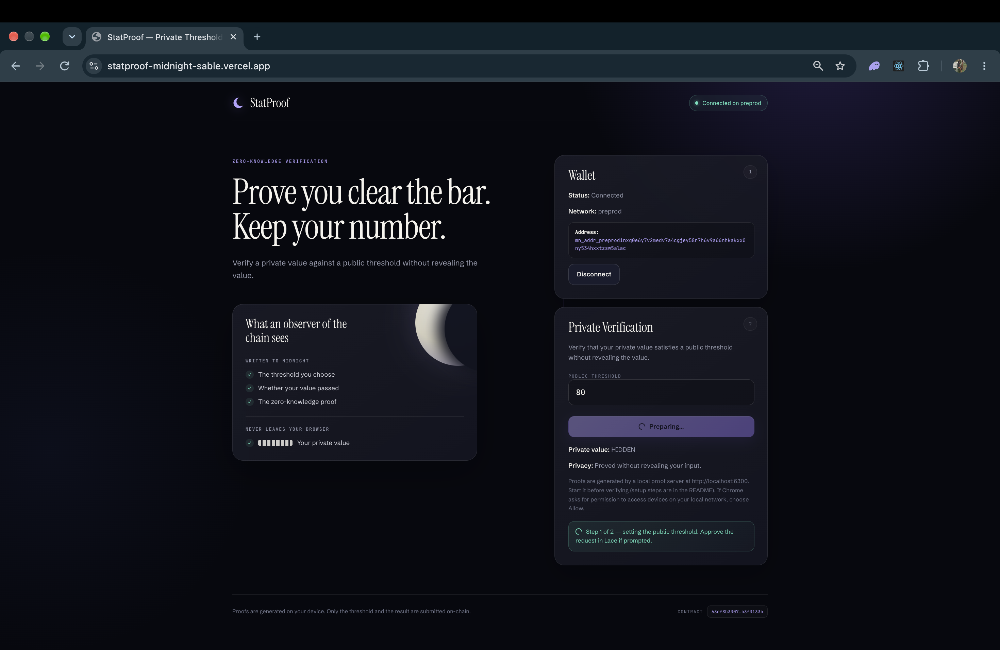
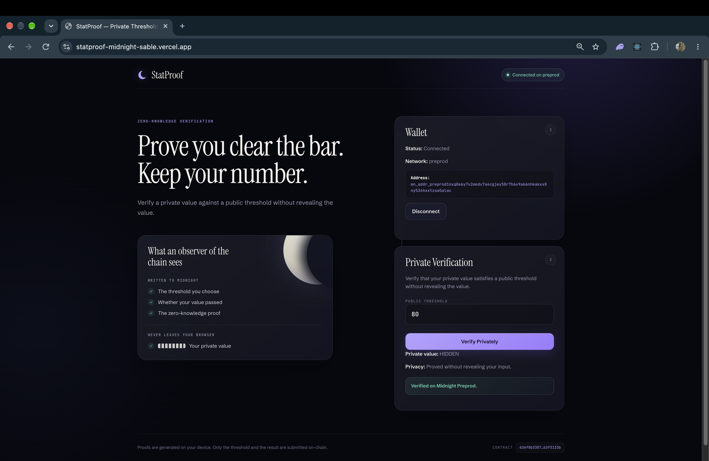
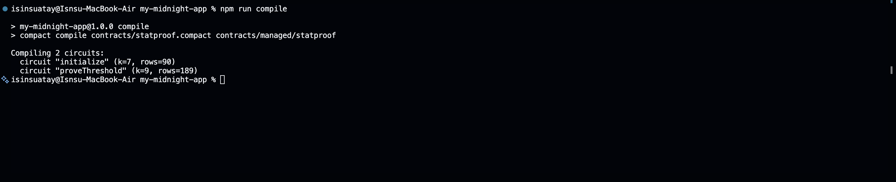
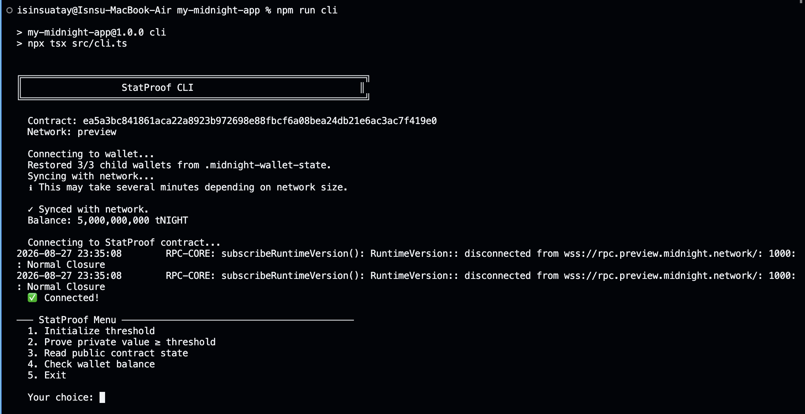
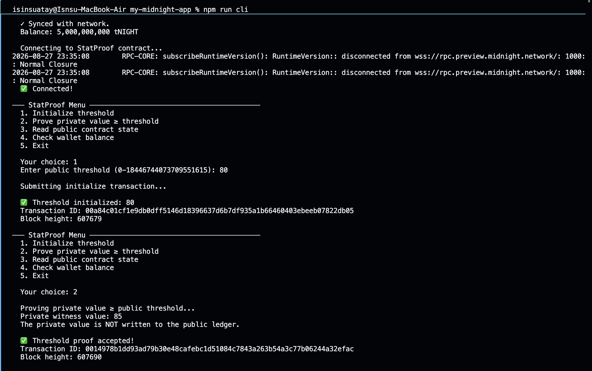
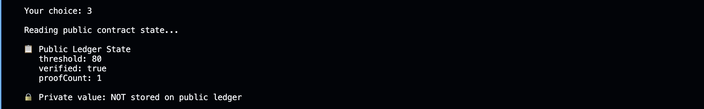

# StatProof


> A privacy-preserving threshold verification dApp on Midnight: prove that a private value clears a public threshold without revealing the value.

StatProof connects to Midnight Preprod through Lace, generates a zero-knowledge proof locally, submits the verification transaction, and shows the public result. The private value is used only as a witness and is never written to the public ledger.

---

## Live Demo

**Frontend:** <https://statproof-midnight-sable.vercel.app/>

**Network:** Midnight Preprod

The live application talks to the deployed StatProof contract on Midnight Preprod. Proof generation runs on a **local proof server on your machine** (`http://localhost:6300`), so see [Using the live demo](#using-the-live-demo) before clicking "Verify Privately".

---

## Contract Address

| Network | Address |
| ------- | ------- |
| **Preview** | `ea5a3bc841861aca22a8923b972698e88fbcf6a08bea24db21e6ac3ac7f419e0` |
| **Preprod** | `63ef8b330776f30e32a3bac80f152fc609fcc2c92c744e7ce624e3c4b3f3133b` |

The frontend is wired to the Preprod address.

---

## What This Does

A user has a private number and wants to prove it satisfies a publicly chosen threshold. The Compact circuit checks:

```
privateValue >= threshold
```

The private value enters the circuit as a private witness. Only the threshold, the boolean result and a proof counter become public state. If the value is below the threshold, no proof can be produced and the transaction fails instead of leaking the value.

---

## Privacy Model

### PUBLIC (on-chain, visible to anyone)

- `threshold`: the public threshold chosen by the user
- `verified`: whether a valid threshold proof was recorded
- `proofCount`: counter of recorded proofs
- transaction and block metadata

### PRIVATE (private witness, never on-chain)

- the private numerical value (`getPrivateValue()` witness)
- any intermediate value used inside the circuit

### PROVED without revealing

- that `privateValue >= threshold`, and nothing else about the value

---

## Privacy Claim

**An on-chain observer sees:** the contract address, the public threshold, the `verified` flag, the `proofCount`, and transaction and block metadata.

**An on-chain observer cannot see:** the private value, or the witness supplied to `proveThreshold`. They only learn that a valid proof against the public threshold exists.

**Honest scope of this demo:** the witness is a fixed demonstration constant inside the frontend, so the demo shows the mechanism rather than protecting a real secret. The app never renders the value, and the UI always shows `Private value: HIDDEN`. StatProof is a technical demonstration, not a production privacy or security guarantee.

---

## Tech Stack

- **Blockchain:** Midnight Network, Compact, Midnight Preprod, zero-knowledge proofs
- **Frontend:** React, Vite, TypeScript, Lace wallet, Midnight dApp Connector API, Midnight.js
- **Tooling:** Node.js 22, npm, Docker / Docker Compose, Midnight Proof Server, Midnight Indexer, Midnight Wallet SDK
- **CI:** GitHub Actions

| Package | Version |
| ------- | ------- |
| `@midnight-ntwrk/compact-runtime` | `0.16.0` |
| `@midnight-ntwrk/midnight-js-*` (contracts, providers, types, utils, protocol, network-id) | `4.1.1` |
| `@midnight-ntwrk/dapp-connector-api` | `4.0.1` |
| `@midnight-ntwrk/wallet-sdk` | `1.2.0` |
| Compact compiler | `0.31.1` |
| Proof server image | `midnightntwrk/proof-server:8.1.0` |
| React / Vite / TypeScript | `19.x` / `8.x` / `6.0.3` |

---

## Prerequisites

- **Node.js 22+** (`node --version`)
- **Docker** running (`docker --version`), needed for the local proof server
- **Compact CLI** (`compact --version`), used to compile the contract (CI uses compiler `0.31.1`)
- **Lace wallet** browser extension (for example in Chrome or Brave), configured for Midnight Preprod and funded with Preprod test tokens

---

## Setup & Run Locally

```bash
git clone https://github.com/isinsuatay/statproof-midnight.git
cd statproof-midnight
npm install
npm run compile            # compile contracts/statproof.compact
docker compose up -d proof-server  # local proof server on port 6300 (Docker must be running)
npm run dev                # Vite dev server, usually http://localhost:5173
```

Open the printed URL in a browser with Lace installed. Check that it is healthy with `docker compose ps` and stop it with `docker compose down`.

### Using the live demo

The live site needs the same local proof server, because Lace does not provide delegated proving:

1. Install Lace and switch it to Midnight Preprod.
2. Clone this repository and run `docker compose up -d proof-server` from its root (Docker must be running). Wait until `docker compose ps` shows the container as healthy.
3. Open the live demo, connect Lace, enter a threshold and click **Verify Privately**. Recent versions of Chrome ask for permission the first time a public website talks to a server on your own machine; choose **Allow**.

If the proof server is not reachable, the app shows a message explaining how to start it.

### Using the app

1. **Connect Lace.** The app checks that the wallet is on `preprod`.
2. **Enter a public threshold**, for example `80`.
3. **Click Verify Privately.** The app runs two steps and Lace may ask you to approve each one: (1) publish the threshold, (2) generate the zero-knowledge proof and submit it.
4. **Read the result:** `Verified on Midnight Preprod.` while `Private value: HIDDEN` stays on screen.

Try a threshold above the demo value to see the failure path: no proof is produced and the message states that nothing about your value was revealed.

---

## Run Tests

```bash
npm test
```

13 tests, no network or wallet required:

- `tests/statproof.test.ts` (6 tests) executes the **compiled contract circuits** through `compact-runtime`: circuit logic (above, equal and below the threshold), state transitions (`initialize`, `proofCount`), and privacy (the private value is absent from public state and circuit output). These tests run circuit logic; they do not generate zero-knowledge proofs.
- `tests/frontend-helpers.test.ts` (7 tests) covers user-facing error messages and strict threshold parsing (`Uint<64>` bounds).

Type-check and build everything:

```bash
npm run build
```

---

## CI/CD

`.github/workflows/ci.yml` runs on every push to `main` and on every pull request:

1. Checkout the code
2. Install Node.js 22
3. `npm ci`
4. Install the Compact compiler `0.31.1` (official `setup-compact-action`)
5. `npm run compile`
6. `npm test`
7. `npm run build` (type-check plus frontend build)

Generated contract artifacts (`contracts/managed/`) are not committed, so CI compiles the contract before testing.

---

## Product Proposal

See [PROPOSAL.md](./PROPOSAL.md).

---

## How It Works

```
Connect Lace -> Validate Preprod -> Choose public threshold
-> initialize(threshold) -> proveThreshold() with private witness
-> Generate ZK proof (local proof server) -> Sign in Lace
-> Submit to Midnight Preprod -> Show verification result
```
---


## Contract Design

Contract: `contracts/statproof.compact` (header comment documents public vs private data).

- `initialize(publicThreshold)`: publishes the threshold, sets `verified = false` and `proofCount = 0`.
- `proveThreshold()`: reads the private witness, asserts `privateValue >= threshold`, then sets `verified = true` and increments `proofCount`. Only the boolean result is deliberately disclosed.

Public ledger after a successful run: `threshold: 80`, `verified: true`, `proofCount: 1`.

## Known Limitations

- The demo witness is a fixed value in the frontend (see Privacy Claim).
- The frontend calls `initialize` before every proof, which resets the counters, so `proofCount` is `1` after each successful run. Anyone can also call `initialize` on this demo contract.
- Proof generation needs a local proof server (see above).
- Testnet only: nothing here is a production guarantee.

## Frontend

React + Vite in `frontend/` (the spec's `src/` frontend), with wallet detection, connect and disconnect, Preprod validation, address display, progress states during proof generation, and clear messages for: Lace missing, connection rejected, wrong network, invalid threshold, proof server unreachable, insufficient funds, and a threshold the private value cannot satisfy.

---

## Screenshots

### Level 3 — Production-Grade dApp



---

### Level 2 — StatProof Frontend



---

### Level 1 — Contract Compilation



### Level 1 — Preview Deployment



### Level 1 — Zero-Knowledge Threshold Proof



### Level 1 — Public Ledger State


---

## Available Commands

| Command | Purpose |
| ------- | ------- |
| `npm install` | Install dependencies |
| `npm run compile` | Compile the Compact contract |
| `npm run build` | Type-check backend and frontend, then build the frontend |
| `npm test` | Run the test suite |
| `npm run dev` | Start the Vite frontend |
| `npm run frontend:build` | Build the frontend only |
| `npm run proof-server:start` | Start the full local Docker stack (node, indexer, proof server) |
| `npm run proof-server:stop` | Stop the local Docker stack |
| `npm run setup` | Run project setup |
| `npm run deploy` | Deploy the contract |
| `npm run cli` | Launch the interactive CLI |
| `npm run check-balance` | Check wallet balances |
| `npm run network` | Show the active network (`preview` or `preprod` to switch) |
| `npm run test:e2e` | End-to-end connectivity check |
| `npm run clean` | Remove generated deployment and runtime state |

## Network Configuration

| Network | Purpose |
| ------- | ------- |
| `undeployed` | Local development |
| `preview` | Midnight Preview test network |
| `preprod` | Midnight Preprod test network (used by the frontend) |

## Security Notes

Never commit wallet recovery phrases, seed phrases, private keys, wallet state or deployment secrets.

---

## Project Structure

The layout differs slightly from the challenge template: the frontend lives in `frontend/` (the template's `src/`), `src/` holds the Node CLI and deploy tooling, and compile output goes to `contracts/managed/` (the template's `managed/`).

```
statproof-midnight/
├── contracts/
│ ├── statproof.compact
│ └── managed/statproof/ # generated by npm run compile, not committed
├── frontend/
│ ├── components/ # WalletConnect.tsx, CircuitCall.tsx
│ ├── hooks/ # useMidnight.ts
│ ├── lib/ # providers, errors, threshold parsing
│ ├── styles/App.css
│ ├── App.tsx
│ ├── main.tsx
│ └── index.html
├── src/ # CLI, wallet, deploy tooling
├── scripts/e2e-check.ts
├── tests/
│ ├── statproof.test.ts
│ └── frontend-helpers.test.ts
├── docs/screenshots/
├── .github/workflows/ci.yml
├── PROPOSAL.md
├── docker-compose.yml
├── package.json
└── README.md
```

---

## Roadmap

- **Level 1 (New Moon):** Compact contract, private threshold circuit, Preview deployment. Complete.
- **Level 2 (Waxing Crescent):** React + Vite frontend, Lace integration, Preprod. Complete.
- **Level 3 (First Quarter):** contract-level tests, CI/CD, error handling, product proposal. This submission.
- **Levels 4-6:** MVP, user feedback, Mainnet launch.

## Demo Videos

- [Level 2 demo](https://www.youtube.com/watch?v=8LGlebqaJIY)
- Level 3 demo: [PASTE LINK AFTER RECORDING]

## License

MIT
